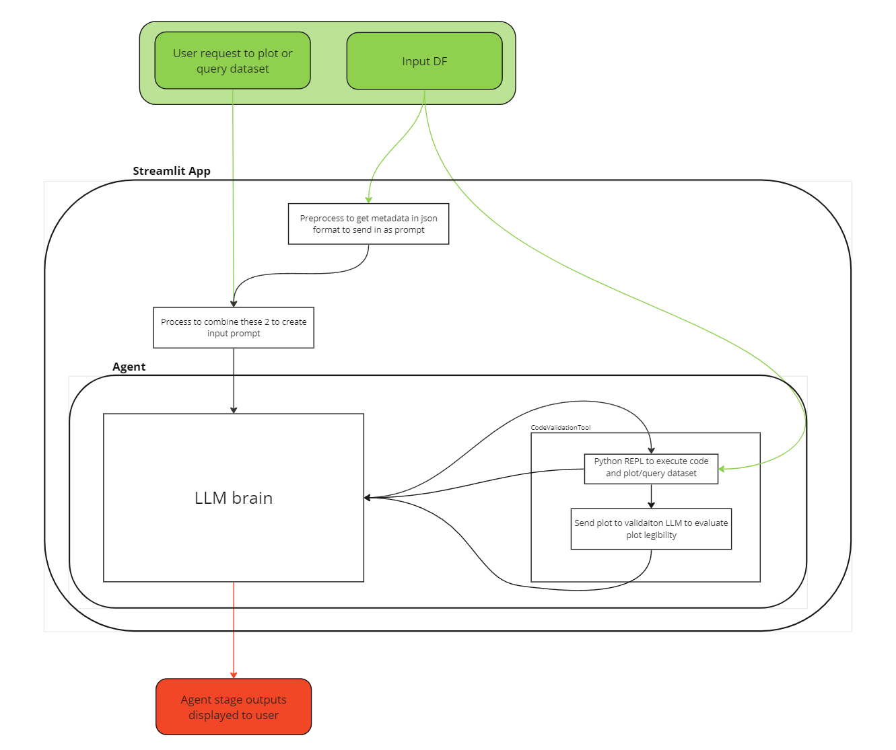
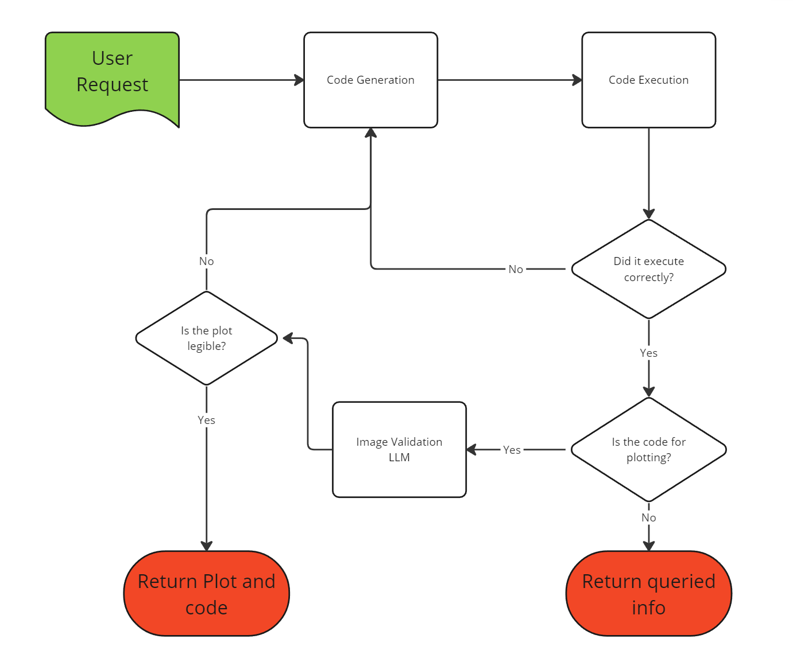

# LLM-plotting

This project presents a Streamlit application that leverages a LLM agent to process dataframes based on natural language requests and helps the user query or plot the dataframe.

## Agent 

Above we have a high level overview of how the Streamlit app functions. The application functions by taking two inputs: a dataframe and a natural language request from the user to either query or plot the dataframe. Upon receiving these inputs, the application proceeds to extract metadata from the dataframe. This includes information such as column names, shape, data types, missing values, and other statistical summaries. This metadata is then stored in a JSON format and combined with the natural language request as an input prompt to help gnereate the code. This approach was chosen instead of sending the entire dataset to the LLM, as gives the LLM a sense of the data without exceeding token limits.

With this input prompt the agent begins to generate code to fulfill the user's request, this generated code is then sent to a code validation tool. The Agent iterates this process, generating and validating code until it produces an output that the validation tool approves. All the while the agent steps are being streamed to the user via the Streamlit app. For a more detailed view of this workflow, please refer to the diagram below.

 Once these are sent to the app the app will gather some metadata about the input dataframe such as the column names, shape, dtypes, missing vlaues and other statistical summaries this is stored in json format and sent in as a part of a prompt. This is done as it would cost too many tokens to send in the whole dataset so just the metadata is sent in the allow the LLM to have a feel of the data.

Then the LLM will start to generate code to fulfull the request and this code is sent to a code validation tool and it will keep iterating until it is satified with sending the user an output, below we can see more detail on this workflow.

## Setup
1. Create a .env file in root and populate keys according to the .env.example file
    - To get an e2b key please go [here](https://e2b.dev/docs)
2. Create the approate virtual env and install packages according to the pyproject.toml
3. Follow E2B set up steps below
4. To run app locally run `make run_app`

### E2B setup

This is a tool used in the repo to run the generated python code within a sandboxed python enviroment. This is done for two reasons:

- Scalability: By using API calls to execute potentially compute-intensive code, we can maintain the efficiency and performance of the application.

- Safety: Running the agent's code in a separate environment from the application ensures security. It prevents any unintended side effects that could potentially disrupt or harm the application's runtime environment.

To set this up please navigate to the e2b folder and follow these steps:

1. Install npm
2. `make install_e2b_cli_and_login`
3. `make build_e2b`

## V2 ideas

- add snapshot pytests
- add ability to upload multiple df's
- Example dataset currently taken from https://www.kaggle.com/datasets/hummaamqaasim/jobs-in-data?resource=download
    - maybe use 